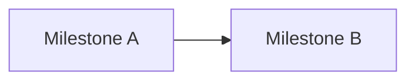

# Master plan: [PROJECT_NAME]

> Version: 0.1  
> Status: DRAFT | REVIEW | APPROVED  
> Last updated: [DATE]

## Purpose

Cross-team **roadmap** (business-first): milestones, dependencies, risks, and release readiness. Technical implementation details live in linked SDD/VDD/ADR flows; this plan focuses on **outcomes, sequencing, and go-to-market readiness**.

---

## 1. Milestones

| Milestone | Outcome | Target date | Owner |
|-----------|---------|-------------|-------|
| M0 | [e.g. Charter frozen] | | |
| M1 | | | |

---

## 2. Workstreams

### 2.1 [Stream name, e.g. Client]

- Deliverables: [list]
- Dependencies: [list]
- Linked specs: [paths]

### 2.2 [Stream name, e.g. Backend]

---

## 3. Dependency graph (narrative or mermaid)

---

## 4. Environments and release

| Environment | Purpose | Branch / tag policy |
|-------------|---------|---------------------|
| | | |

Add business release readiness items (examples):

- Store listings / screenshots / copy readiness
- Pricing / fees / promotions toggles prepared
- Support playbooks and moderation policies ready
- Compliance review done (claims, refunds, KYC if applicable, Telegram policies)

---

## 5. Risks and mitigations

| Risk | Likelihood | Impact | Mitigation | Owner |
|------|------------|--------|------------|-------|
| | | | | |

---

## 6. Open decisions

| ID | Decision | Options | Deadline |
|----|----------|---------|----------|
| D1 | | | |

---

## Approvals

**Approval phrase to start implementation**: “master plan approved”
